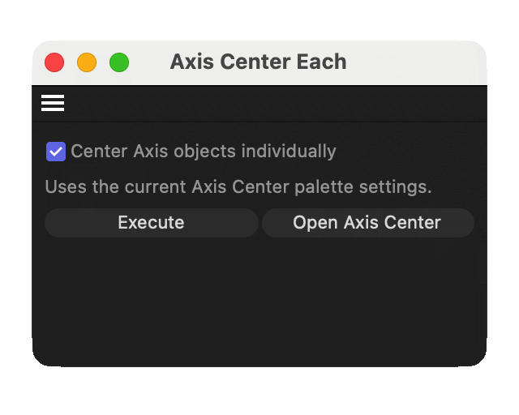

# Axis Center Each

A Cinema 4D **2026** plugin that fixes one gap in the stock **Axis Center** tools.



## What it does

Cinema 4D’s Axis Center palette can move an object’s axis (for example to the center of its points, or align it to World). That works great for one object.

If you select **many** objects and press Execute, Axis Center treats them as **one group**. You get a single shared axis for the whole selection — not a centered axis on each object. For a handful of objects that’s annoying; for tens or hundreds it’s a real time sink.

**Axis Center Each** is a small dockable palette that sits next to Axis Center and adds:

- A checkbox: **Center Axis objects individually**
- An **Execute** button that runs the same Axis Center action **once per selected object**, using whatever settings you already chose on the stock palette (Action, Center, Alignment, Include Children, and so on)

So you keep configuring Axis Center the way you always do — this plugin only changes the selection scope from “the group” to “each object.”

## Install (Cinema 4D 2026)

1. Download `AxisCenterEach.pyp` from the [latest release](https://github.com/HelloFieldgate/c4d-axis-center-each/releases/latest), **or** copy it from this repo at `plugins/AxisCenterEach/AxisCenterEach.pyp`.

2. Put that file in your Cinema 4D prefs **plugins** folder:

   **macOS**
   ```bash
   cp AxisCenterEach.pyp \
     "$HOME/Library/Preferences/Maxon/Maxon Cinema 4D 2026_"*/plugins/
   ```

   **Windows** (PowerShell — adjust the `2026_*` folder name if needed):
   ```powershell
   Copy-Item AxisCenterEach.pyp "$env:APPDATA\Maxon\Maxon Cinema 4D 2026_*\plugins\"
   ```

3. Use a **real file copy**, not a symlink — Cinema 4D on macOS often skips symlinked plugins.

4. Restart Cinema 4D.

5. Open **Extensions → Axis Center Each** (or press Shift+C / Commander and search for it).

## Usage

1. Set options on the stock **Axis Center** palette as usual.
2. Multi-select the objects you want.
3. In **Axis Center Each**, leave the checkbox on and press **Execute**.
4. The status line reports how many objects were centered.

With the checkbox off, use the stock palette’s Execute if you want the normal group behavior.

## Requirements

- Cinema 4D **2026**
- No extra dependencies

## License

MIT — see [LICENSE](LICENSE).
